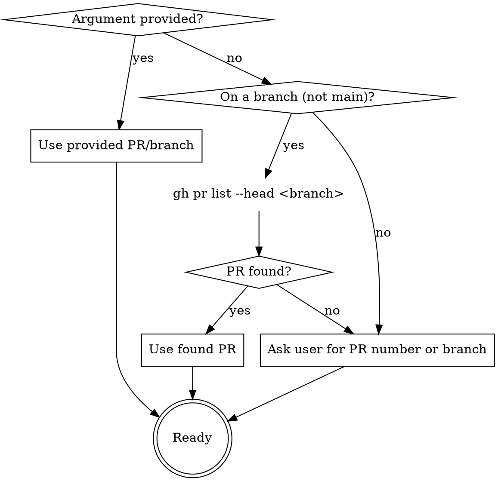
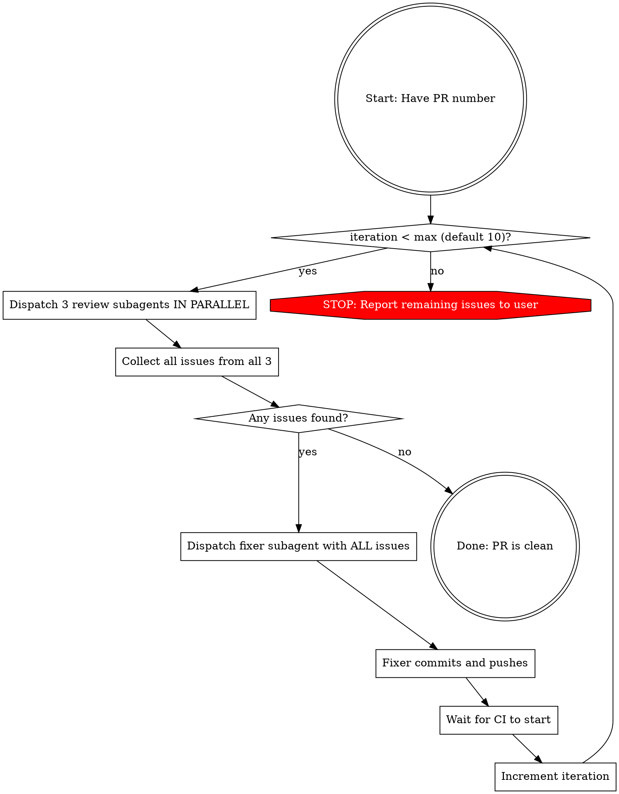

# PR Review-Fix Loop

Orchestrate an automated review-fix loop for a PR using subagents. You are the **controller only** - you dispatch subagents and manage the loop. You NEVER read code, edit files, run tests, or fix issues yourself.

**Core principle:** Controller dispatches, subagents work. Fresh context per review. Loop until clean or max iterations.

## Input Resolution



## The Loop



## Subagent Dispatch

### Review Phase (3 subagents in parallel via a single message with 3 Agent tool calls)

| #   | Subagent Type               | Model   | Prompt essence                                                                                                                                                                                                                                                                                                                                                                                                                                                                                                                        |
| --- | --------------------------- | ------- | ------------------------------------------------------------------------------------------------------------------------------------------------------------------------------------------------------------------------------------------------------------------------------------------------------------------------------------------------------------------------------------------------------------------------------------------------------------------------------------------------------------------------------------- |
| 1   | `superpowers:code-reviewer` | default | Review PR #{number} diff (base..HEAD). Return `[CRITICAL/IMPORTANT/MINOR] file:line - description` or `NO ISSUES`.                                                                                                                                                                                                                                                                                                                                                                                                                    |
| 2   | `general-purpose`           | haiku   | Check CI status (`gh pr checks`), CodeQL alerts (`gh api code-scanning/alerts`), lint results for PR #{number}. Return `[CI_FAIL/CODEQL/LINT] check - description` or `NO ISSUES`.                                                                                                                                                                                                                                                                                                                                                    |
| 3   | `general-purpose`           | haiku   | Check ALL comments on PR #{number} from ALL sources and ALL authors (human and bot alike). Query all three endpoints: (1) `gh api repos/{owner}/{repo}/pulls/{number}/comments` — inline review comments, (2) `gh api repos/{owner}/{repo}/pulls/{number}/reviews` — review submissions, (3) `gh api repos/{owner}/{repo}/issues/{number}/comments` — general comments. Every comment is potentially actionable. Report each as `[COMMENT] author: summary (source)` or `NO ISSUES` if all three endpoints return nothing actionable. |

### Fix Phase (1 subagent, sequential after all reviews complete)

| Subagent Type     | Model   | Prompt essence                                                                                                                                                                                                                                                                        |
| ----------------- | ------- | ------------------------------------------------------------------------------------------------------------------------------------------------------------------------------------------------------------------------------------------------------------------------------------- |
| `general-purpose` | default | Fix ALL issues below on branch {branch}. Prioritize CRITICAL > IMPORTANT > MINOR. After fixing, verify with `npm test`, `npx tsc --noEmit`, `npm run test:typecheck`, and `npm run docs:check` (run from `packages/xfg/`), and `./lint.sh` (run from the repo root). All five must pass before committing. Commit and **push**. Report what was fixed and what remains. `{combined_issues}` |

## Controller Rules

You are the controller: you dispatch subagents and track the loop, and you don't read code, edit files, run tests/lint/build, commit, or fix anything yourself - not even one small thing. Keeping the controller out of the code keeps each reviewer's context fresh and independent.

- Dispatch all 3 review subagents in parallel (single message, 3 Agent calls), every iteration - comments and CI results can appear mid-loop.
- Dispatch the fixer only after collecting ALL review results, then loop back to a fresh review even if the fixer reports done.
- Treat every comment as actionable, including bot comments (coverage, lint, security).
- If a reviewer returns unusable output, dispatch it again rather than interpreting it.
- Track the iteration count and report progress between iterations.
- Stop at max iterations (default 10, change only with user consent) and report remaining issues.

**Between iterations, report:**

```
Iteration {n}/{max}: {summary}
- Code review: {n} issues
- CI/CodeQL: {n} issues
- Comments: {n} items
```
