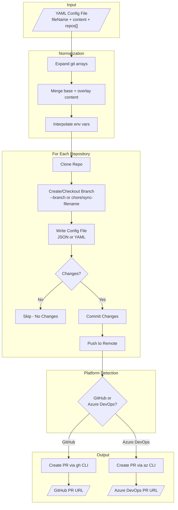

# json-config-sync

[](https://github.com/anthony-spruyt/json-config-sync/actions/workflows/ci.yml)
[](https://github.com/anthony-spruyt/json-config-sync/actions/workflows/integration-test.yml)
[](https://www.npmjs.com/package/@aspruyt/json-config-sync)
[](https://www.npmjs.com/package/@aspruyt/json-config-sync)

A CLI tool that syncs JSON or YAML configuration files across multiple GitHub and Azure DevOps repositories by creating pull requests. Output format is automatically detected from the target filename extension.

## Table of Contents

- [Quick Start](#quick-start)
- [Features](#features)
- [How It Works](#how-it-works)
- [Installation](#installation)
- [Prerequisites](#prerequisites)
- [Usage](#usage)
- [Configuration Format](#configuration-format)
- [Examples](#examples)
- [Supported Git URL Formats](#supported-git-url-formats)
- [CI/CD Integration](#cicd-integration)
- [Output Examples](#output-examples)
- [Troubleshooting](#troubleshooting)
- [IDE Integration](#ide-integration)
- [Development](#development)
- [License](#license)

## Quick Start

```bash
# Install
npm install -g @aspruyt/json-config-sync

# Authenticate (GitHub)
gh auth login

# Create config.yaml
cat > config.yaml << 'EOF'
fileName: .prettierrc.json

# Base configuration inherited by all repos
content:
  semi: false
  singleQuote: true
  tabWidth: 2
  trailingComma: es5

repos:
  # Multiple repos can share the same config
  - git:
      - git@github.com:your-org/frontend-app.git
      - git@github.com:your-org/backend-api.git
      - git@github.com:your-org/shared-lib.git
EOF

# Run
json-config-sync --config ./config.yaml
```

**Result:** PRs are created in all three repos with identical `.prettierrc.json` files.

## Features

- **JSON/YAML Output** - Automatically outputs JSON or YAML based on filename extension
- **Content Inheritance** - Define base config once, override per-repo as needed
- **Multi-Repo Targeting** - Apply same config to multiple repos with array syntax
- **Environment Variables** - Use `${VAR}` syntax for dynamic values
- **Merge Strategies** - Control how arrays merge (replace, append, prepend)
- **Override Mode** - Skip merging entirely for specific repos
- **GitHub & Azure DevOps** - Works with both platforms
- **Dry-Run Mode** - Preview changes without creating PRs
- **Error Resilience** - Continues processing if individual repos fail
- **Automatic Retries** - Retries transient network errors with exponential backoff

## Installation

### From npm

```bash
npm install -g @aspruyt/json-config-sync
```

### From Source

```bash
git clone https://github.com/anthony-spruyt/json-config-sync.git
cd json-config-sync
npm install
npm run build
```

### Using Dev Container

Open this repository in VS Code with the Dev Containers extension. The container includes all dependencies pre-installed and the project pre-built.

## Prerequisites

### GitHub Authentication

Before using with GitHub repositories, authenticate with the GitHub CLI:

```bash
gh auth login
```

### Azure DevOps Authentication

Before using with Azure DevOps repositories, authenticate with the Azure CLI:

```bash
az login
az devops configure --defaults organization=https://dev.azure.com/YOUR_ORG project=YOUR_PROJECT
```

## Usage

```bash
# Basic usage
json-config-sync --config ./config.yaml

# Dry run (no changes made)
json-config-sync --config ./config.yaml --dry-run

# Custom work directory
json-config-sync --config ./config.yaml --work-dir ./my-temp

# Custom branch name
json-config-sync --config ./config.yaml --branch feature/update-eslint
```

### Options

| Option       | Alias | Description                                             | Required |
| ------------ | ----- | ------------------------------------------------------- | -------- |
| `--config`   | `-c`  | Path to YAML config file                                | Yes      |
| `--dry-run`  | `-d`  | Show what would be done without making changes          | No       |
| `--work-dir` | `-w`  | Temporary directory for cloning (default: `./tmp`)      | No       |
| `--retries`  | `-r`  | Number of retries for network operations (default: 3)   | No       |
| `--branch`   | `-b`  | Override branch name (default: `chore/sync-{filename}`) | No       |

## Configuration Format

### Basic Structure

```yaml
fileName: my.config.json # Target file (.json outputs JSON, .yaml/.yml outputs YAML)
mergeStrategy: replace # Default array merge strategy (optional)

content: # Base config content (optional)
  key: value

repos: # List of repositories
  - git: git@github.com:org/repo.git
    content: # Per-repo overlay (optional if base content exists)
      key: override
```

### Root-Level Fields

| Field           | Description                                                            | Required |
| --------------- | ---------------------------------------------------------------------- | -------- |
| `fileName`      | Target file name (`.json` → JSON output, `.yaml`/`.yml` → YAML output) | Yes      |
| `content`       | Base config inherited by all repos                                     | No\*     |
| `mergeStrategy` | Default array merge strategy: `replace`, `append`, `prepend`           | No       |
| `repos`         | Array of repository configurations                                     | Yes      |

\* Required if any repo entry omits the `content` field.

### Per-Repo Fields

| Field      | Description                                                | Required |
| ---------- | ---------------------------------------------------------- | -------- |
| `git`      | Git URL (string) or array of URLs                          | Yes      |
| `content`  | Content overlay merged onto base (optional if base exists) | No\*     |
| `override` | If `true`, ignore base content and use only this repo's    | No       |

\* Required if no root-level `content` is defined.

### Environment Variables

Use `${VAR}` syntax in string values:

```yaml
content:
  apiUrl: ${API_URL} # Required - errors if not set
  environment: ${ENV:-development} # With default value
  secretKey: ${SECRET:?Secret required} # Required with custom error message
```

### Merge Directives

Control array merging with the `$arrayMerge` directive:

```yaml
content:
  features:
    - core
    - monitoring

repos:
  - git: git@github.com:org/repo.git
    content:
      features:
        $arrayMerge: append # append | prepend | replace
        values:
          - custom-feature # Results in: [core, monitoring, custom-feature]
```

## Examples

### Shared Config Across Teams

Define common settings once, customize per team:

```yaml
fileName: service.config.json

content:
  version: "2.0"
  logging:
    level: info
    format: json
  features:
    - health-check
    - metrics

repos:
  # Platform team repos - add extra features
  - git:
      - git@github.com:org/api-gateway.git
      - git@github.com:org/auth-service.git
    content:
      team: platform
      features:
        $arrayMerge: append
        values:
          - tracing
          - rate-limiting

  # Data team repos - different logging
  - git:
      - git@github.com:org/data-pipeline.git
      - git@github.com:org/analytics.git
    content:
      team: data
      logging:
        level: debug

  # Legacy service - completely different config
  - git: git@github.com:org/legacy-api.git
    override: true
    content:
      version: "1.0"
      legacy: true
```

### Environment-Specific Values

Use environment variables for secrets and environment-specific values:

```yaml
fileName: app.config.json

content:
  database:
    host: ${DB_HOST:-localhost}
    port: ${DB_PORT:-5432}
    password: ${DB_PASSWORD:?Database password required}

  api:
    baseUrl: ${API_BASE_URL}
    timeout: 30000

repos:
  - git: git@github.com:org/backend.git
```

### Simple Multi-Repo Sync

When all repos need identical config:

```yaml
fileName: .eslintrc.json

content:
  extends: ["@org/eslint-config"]
  rules:
    no-console: warn

repos:
  - git:
      - git@github.com:org/frontend.git
      - git@github.com:org/backend.git
      - git@github.com:org/shared-lib.git
      - git@github.com:org/cli-tool.git
```

## Supported Git URL Formats

### GitHub

- SSH: `git@github.com:owner/repo.git`
- HTTPS: `https://github.com/owner/repo.git`

### Azure DevOps

- SSH: `git@ssh.dev.azure.com:v3/organization/project/repo`
- HTTPS: `https://dev.azure.com/organization/project/_git/repo`

## How It Works



For each repository in the config, the tool:

1. Expands git URL arrays into individual entries
2. Merges base content with per-repo overlay
3. Interpolates environment variables
4. Cleans the temporary workspace
5. Clones the repository
6. Creates/checks out branch (custom `--branch` or default `chore/sync-{sanitized-filename}`)
7. Generates the config file (JSON or YAML based on filename extension)
8. Checks for changes (skips if no changes)
9. Commits and pushes changes
10. Creates a pull request

## CI/CD Integration

### GitHub Actions

```yaml
name: Sync Configs
on:
  push:
    branches: [main]
    paths: ["config.yaml"]

jobs:
  sync:
    runs-on: ubuntu-latest
    steps:
      - uses: actions/checkout@v4
      - uses: actions/setup-node@v4
        with:
          node-version: "20"
      - run: npm install -g @aspruyt/json-config-sync
      - run: json-config-sync --config ./config.yaml
        env:
          GH_TOKEN: ${{ secrets.GH_PAT }}
```

> **Note:** `GH_PAT` must be a Personal Access Token with `repo` scope to create PRs in target repositories.

### Azure Pipelines

```yaml
trigger:
  branches:
    include: [main]
  paths:
    include: ["config.yaml"]

pool:
  vmImage: "ubuntu-latest"

steps:
  - task: NodeTool@0
    inputs:
      versionSpec: "20.x"
  - script: npm install -g @aspruyt/json-config-sync
    displayName: "Install json-config-sync"
  - script: json-config-sync --config ./config.yaml
    displayName: "Sync configs"
    env:
      AZURE_DEVOPS_EXT_PAT: $(System.AccessToken)
```

> **Note:** Ensure the build service account has permission to create PRs in target repositories.

## Output Examples

### Console Output

```
[1/3] Processing example-org/repo1...
  ✓ Cloned repository
  ✓ Created branch chore/sync-my-config
  ✓ Wrote my.config.json
  ✓ Committed changes
  ✓ Pushed to remote
  ✓ Created PR: https://github.com/example-org/repo1/pull/42

[2/3] Processing example-org/repo2...
  ✓ Cloned repository
  ✓ Checked out existing branch chore/sync-my-config
  ✓ Wrote my.config.json
  ⊘ No changes detected, skipping

[3/3] Processing example-org/repo3...
  ✓ Cloned repository
  ✓ Created branch chore/sync-my-config
  ✓ Wrote my.config.json
  ✓ Committed changes
  ✓ Pushed to remote
  ✓ PR already exists: https://github.com/example-org/repo3/pull/15

Summary: 2 succeeded, 1 skipped, 0 failed
```

### Created PR

The tool creates PRs with:

- **Title:** `chore: sync {fileName}`
- **Branch:** `chore/sync-{sanitized-filename}`
- **Body:** Describes the sync action and links to documentation

## Troubleshooting

### Authentication Errors

**GitHub:**

```bash
# Check authentication status
gh auth status

# Re-authenticate if needed
gh auth login
```

**Azure DevOps:**

```bash
# Check authentication status
az account show

# Re-authenticate if needed
az login
az devops configure --defaults organization=https://dev.azure.com/YOUR_ORG
```

### Permission Denied

- Ensure your token has write access to the target repositories
- For GitHub, the token needs `repo` scope
- For Azure DevOps, ensure the user/service account has "Contribute to pull requests" permission

### Branch Already Exists

The tool automatically reuses existing branches. If you see unexpected behavior:

```bash
# Delete the remote branch to start fresh
git push origin --delete chore/sync-my-config
```

### Missing Environment Variables

If you see "Missing required environment variable" errors:

```bash
# Set the variable before running
export MY_VAR=value
json-config-sync --config ./config.yaml

# Or use default values in config
# ${MY_VAR:-default-value}
```

### Network/Proxy Issues

If cloning fails behind a corporate proxy:

```bash
# Configure git proxy
git config --global http.proxy http://proxy.example.com:8080
git config --global https.proxy http://proxy.example.com:8080
```

### Transient Network Errors

The tool automatically retries transient errors (timeouts, connection resets, rate limits) with exponential backoff. By default, it retries 3 times before failing.

```bash
# Increase retries for unreliable networks
json-config-sync --config ./config.yaml --retries 5

# Disable retries
json-config-sync --config ./config.yaml --retries 0
```

Permanent errors (authentication failures, permission denied, repository not found) are not retried.

## IDE Integration

### VS Code YAML Schema Support

For autocomplete and validation in VS Code, install the [YAML extension](https://marketplace.visualstudio.com/items?itemName=redhat.vscode-yaml) and add a schema reference to your config file:

**Option 1: Inline comment**

```yaml
# yaml-language-server: $schema=https://raw.githubusercontent.com/anthony-spruyt/json-config-sync/main/config-schema.json
fileName: my.config.json
content:
  key: value
repos:
  - git: git@github.com:org/repo.git
```

**Option 2: VS Code settings** (`.vscode/settings.json`)

```json
{
  "yaml.schemas": {
    "https://raw.githubusercontent.com/anthony-spruyt/json-config-sync/main/config-schema.json": [
      "**/sync-config.yaml",
      "**/config-sync.yaml"
    ]
  }
}
```

This enables:

- Autocomplete for `fileName`, `mergeStrategy`, `repos`, `content`, `git`, `override`
- Enum suggestions for `mergeStrategy` values (`replace`, `append`, `prepend`)
- Validation of required fields
- Hover documentation for each field

## Development

```bash
# Run in development mode
npm run dev -- --config ./fixtures/test-repos-input.yaml --dry-run

# Run tests
npm test

# Build
npm run build
```

## License

MIT
