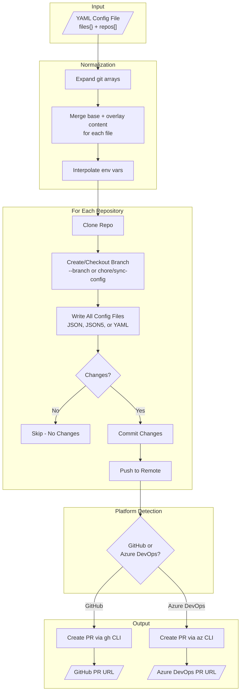

# xfg

[](https://github.com/anthony-spruyt/xfg/actions/workflows/ci.yml)
[](https://www.npmjs.com/package/@aspruyt/xfg)
[](https://www.npmjs.com/package/@aspruyt/xfg)
[](LICENSE)

A CLI tool that syncs JSON, JSON5, YAML, or text configuration files across multiple GitHub and Azure DevOps repositories by creating pull requests. Output format is automatically detected from the target filename extension (`.json` → JSON, `.json5` → JSON5, `.yaml`/`.yml` → YAML, other → text).

## Table of Contents

- [Quick Start](#quick-start)
- [Features](#features)
- [How It Works](#how-it-works)
- [Installation](#installation)
- [Prerequisites](#prerequisites)
- [Usage](#usage)
- [Configuration Format](#configuration-format)
- [Examples](#examples)
- [Supported Git URL Formats](#supported-git-url-formats)
- [CI/CD Integration](#cicd-integration)
- [Output Examples](#output-examples)
- [Troubleshooting](#troubleshooting)
- [IDE Integration](#ide-integration)
- [Development](#development)
- [License](#license)

## Quick Start

```bash
# Install
npm install -g @aspruyt/xfg

# Authenticate (GitHub)
gh auth login

# Create config.yaml
cat > config.yaml << 'EOF'
files:
  .prettierrc.json:
    content:
      semi: false
      singleQuote: true
      tabWidth: 2
      trailingComma: es5

repos:
  # Multiple repos can share the same config
  - git:
      - git@github.com:your-org/frontend-app.git
      - git@github.com:your-org/backend-api.git
      - git@github.com:your-org/shared-lib.git
EOF

# Run
xfg --config ./config.yaml
```

**Result:** PRs are created in all three repos with identical `.prettierrc.json` files.

## Features

- **Multi-File Sync** - Sync multiple config files in a single run
- **Multi-Format Output** - JSON, YAML, or plain text based on filename extension
- **Subdirectory Support** - Sync files to any path (e.g., `.github/workflows/ci.yml`)
- **Text Files** - Sync `.gitignore`, `.markdownlintignore`, etc. with string or lines array
- **File References** - Use `@path/to/file` to load content from external template files
- **Content Inheritance** - Define base config once, override per-repo as needed
- **Multi-Repo Targeting** - Apply same config to multiple repos with array syntax
- **Environment Variables** - Use `${VAR}` syntax for dynamic values
- **Merge Strategies** - Control how arrays merge (replace, append, prepend)
- **Override Mode** - Skip merging entirely for specific repos
- **Empty Files** - Create files with no content (e.g., `.prettierignore`)
- **YAML Comments** - Add header comments and schema directives to YAML files
- **GitHub & Azure DevOps** - Works with both platforms
- **Auto-Merge PRs** - Automatically merge PRs when checks pass, or force merge with admin privileges
- **Dry-Run Mode** - Preview changes without creating PRs
- **Error Resilience** - Continues processing if individual repos fail
- **Automatic Retries** - Retries transient network errors with exponential backoff

## Installation

### From npm

```bash
npm install -g @aspruyt/xfg
```

### From Source

```bash
git clone https://github.com/anthony-spruyt/xfg.git
cd xfg
npm install
npm run build
```

### Using Dev Container

Open this repository in VS Code with the Dev Containers extension. The container includes all dependencies pre-installed and the project pre-built.

## Prerequisites

### GitHub Authentication

Before using with GitHub repositories, authenticate with the GitHub CLI:

```bash
gh auth login
```

### Azure DevOps Authentication

Before using with Azure DevOps repositories, authenticate with the Azure CLI:

```bash
az login
az devops configure --defaults organization=https://dev.azure.com/YOUR_ORG project=YOUR_PROJECT
```

## Usage

```bash
# Basic usage
xfg --config ./config.yaml

# Dry run (no changes made)
xfg --config ./config.yaml --dry-run

# Custom work directory
xfg --config ./config.yaml --work-dir ./my-temp

# Custom branch name
xfg --config ./config.yaml --branch feature/update-eslint
```

### Options

| Option             | Alias | Description                                                                          | Required |
| ------------------ | ----- | ------------------------------------------------------------------------------------ | -------- |
| `--config`         | `-c`  | Path to YAML config file                                                             | Yes      |
| `--dry-run`        | `-d`  | Show what would be done without making changes                                       | No       |
| `--work-dir`       | `-w`  | Temporary directory for cloning (default: `./tmp`)                                   | No       |
| `--retries`        | `-r`  | Number of retries for network operations (default: 3)                                | No       |
| `--branch`         | `-b`  | Override branch name (default: `chore/sync-config`)                                  | No       |
| `--merge`          | `-m`  | PR merge mode: `manual` (default), `auto` (merge when checks pass), `force` (bypass) | No       |
| `--merge-strategy` |       | Merge strategy: `merge` (default), `squash`, `rebase`                                | No       |
| `--delete-branch`  |       | Delete source branch after merge                                                     | No       |

## Configuration Format

### Basic Structure

```yaml
files:
  my.config.json: # Target file (.json outputs JSON, .yaml/.yml outputs YAML)
    mergeStrategy: replace # Array merge strategy for this file (optional)
    content: # Base config content
      key: value

repos: # List of repositories
  - git: git@github.com:org/repo.git
    files: # Per-repo file overrides (optional)
      my.config.json:
        content:
          key: override
```

### Root-Level Fields

| Field       | Description                                          | Required |
| ----------- | ---------------------------------------------------- | -------- |
| `files`     | Map of target filenames to configs                   | Yes      |
| `repos`     | Array of repository configurations                   | Yes      |
| `prOptions` | Global PR merge options (can be overridden per-repo) | No       |

### Per-File Fields

| Field           | Description                                                                                                                                         | Required |
| --------------- | --------------------------------------------------------------------------------------------------------------------------------------------------- | -------- |
| `content`       | Base config: object for JSON/YAML files, string or string[] for text files, or `@path/to/file` to load from external template (omit for empty file) | No       |
| `mergeStrategy` | Merge strategy: `replace`, `append`, `prepend` (for arrays and text lines)                                                                          | No       |
| `createOnly`    | If `true`, only create file if it doesn't exist                                                                                                     | No       |
| `executable`    | Mark file as executable. `.sh` files are auto-executable unless set to `false`. Set to `true` for non-.sh files.                                    | No       |
| `header`        | Comment line(s) at top of YAML files (string or array)                                                                                              | No       |
| `schemaUrl`     | Adds `# yaml-language-server: $schema=<url>` to YAML files                                                                                          | No       |

### Per-Repo Fields

| Field       | Description                                  | Required |
| ----------- | -------------------------------------------- | -------- |
| `git`       | Git URL (string) or array of URLs            | Yes      |
| `files`     | Per-repo file overrides (optional)           | No       |
| `prOptions` | Per-repo PR merge options (overrides global) | No       |

### PR Options Fields

| Field           | Description                                                                 | Default  |
| --------------- | --------------------------------------------------------------------------- | -------- |
| `merge`         | Merge mode: `manual` (leave open), `auto` (merge when checks pass), `force` | `manual` |
| `mergeStrategy` | How to merge: `merge`, `squash`, `rebase`                                   | `merge`  |
| `deleteBranch`  | Delete source branch after merge                                            | `false`  |
| `bypassReason`  | Reason for bypassing policies (Azure DevOps only, required for `force`)     | -        |

### Per-Repo File Override Fields

| Field        | Description                                             | Required |
| ------------ | ------------------------------------------------------- | -------- |
| `content`    | Content overlay merged onto file's base content         | No       |
| `override`   | If `true`, ignore base content and use only this repo's | No       |
| `createOnly` | Override root-level `createOnly` for this repo          | No       |
| `executable` | Override root-level `executable` for this repo          | No       |
| `header`     | Override root-level `header` for this repo              | No       |
| `schemaUrl`  | Override root-level `schemaUrl` for this repo           | No       |

**File Exclusion:** Set a file to `false` to exclude it from a specific repo:

```yaml
repos:
  - git: git@github.com:org/repo.git
    files:
      eslint.json: false # This repo won't receive eslint.json
```

### Environment Variables

Use `${VAR}` syntax in string values:

```yaml
files:
  app.config.json:
    content:
      apiUrl: ${API_URL} # Required - errors if not set
      environment: ${ENV:-development} # With default value
      secretKey: ${SECRET:?Secret required} # Required with custom error message

repos:
  - git: git@github.com:org/backend.git
```

#### Escaping Variable Syntax

If your target file needs literal `${VAR}` syntax (e.g., for devcontainer.json, shell scripts, or other templating systems), use `$$` to escape:

```yaml
files:
  .devcontainer/devcontainer.json:
    content:
      name: my-dev-container
      remoteEnv:
        # Escaped - outputs literal ${localWorkspaceFolder} for VS Code
        LOCAL_WORKSPACE_FOLDER: "$${localWorkspaceFolder}"
        CONTAINER_WORKSPACE: "$${containerWorkspaceFolder}"
        # Interpolated - replaced with actual env value
        API_KEY: "${API_KEY}"
```

Output:

```json
{
  "name": "my-dev-container",
  "remoteEnv": {
    "LOCAL_WORKSPACE_FOLDER": "${localWorkspaceFolder}",
    "CONTAINER_WORKSPACE": "${containerWorkspaceFolder}",
    "API_KEY": "actual-api-key-value"
  }
}
```

This follows the same escape convention used by Docker Compose.

### Merge Directives

Control array merging with the `$arrayMerge` directive:

```yaml
files:
  config.json:
    content:
      features:
        - core
        - monitoring

repos:
  - git: git@github.com:org/repo.git
    files:
      config.json:
        content:
          features:
            $arrayMerge: append # append | prepend | replace
            values:
              - custom-feature # Results in: [core, monitoring, custom-feature]
```

## Examples

### Multi-File Sync

Sync multiple configuration files to all repos:

```yaml
files:
  .eslintrc.json:
    content:
      extends: ["@org/eslint-config"]
      rules:
        no-console: warn

  .prettierrc.yaml:
    content:
      semi: false
      singleQuote: true

  tsconfig.json:
    content:
      compilerOptions:
        strict: true
        target: ES2022

repos:
  - git:
      - git@github.com:org/frontend.git
      - git@github.com:org/backend.git
      - git@github.com:org/shared-lib.git
```

### Shared Config Across Teams

Define common settings once, customize per team:

```yaml
files:
  service.config.json:
    content:
      version: "2.0"
      logging:
        level: info
        format: json
      features:
        - health-check
        - metrics

repos:
  # Platform team repos - add extra features
  - git:
      - git@github.com:org/api-gateway.git
      - git@github.com:org/auth-service.git
    files:
      service.config.json:
        content:
          team: platform
          features:
            $arrayMerge: append
            values:
              - tracing
              - rate-limiting

  # Data team repos - different logging
  - git:
      - git@github.com:org/data-pipeline.git
      - git@github.com:org/analytics.git
    files:
      service.config.json:
        content:
          team: data
          logging:
            level: debug

  # Legacy service - completely different config
  - git: git@github.com:org/legacy-api.git
    files:
      service.config.json:
        override: true
        content:
          version: "1.0"
          legacy: true
```

### Environment-Specific Values

Use environment variables for secrets and environment-specific values:

```yaml
files:
  app.config.json:
    content:
      database:
        host: ${DB_HOST:-localhost}
        port: ${DB_PORT:-5432}
        password: ${DB_PASSWORD:?Database password required}

      api:
        baseUrl: ${API_BASE_URL}
        timeout: 30000

repos:
  - git: git@github.com:org/backend.git
```

### Per-File Merge Strategies

Different files can use different array merge strategies:

```yaml
files:
  eslint.config.json:
    mergeStrategy: append # Extends will append
    content:
      extends: ["@company/base"]

  tsconfig.json:
    mergeStrategy: replace # Lib will replace entirely
    content:
      compilerOptions:
        lib: ["ES2022"]

repos:
  - git: git@github.com:org/frontend.git
    files:
      eslint.config.json:
        content:
          extends: ["plugin:react/recommended"]
      # Results in extends: ["@company/base", "plugin:react/recommended"]
```

### Create-Only Files (Defaults That Can Be Customized)

Some files should only be created once as defaults, allowing repos to maintain their own versions:

```yaml
files:
  .trivyignore.yaml:
    createOnly: true # Only create if doesn't exist
    content:
      vulnerabilities: []

  .prettierignore:
    createOnly: true
    content:
      patterns:
        - "dist/"
        - "node_modules/"

  eslint.config.json:
    content: # Always synced (no createOnly)
      extends: ["@company/base"]

repos:
  - git: git@github.com:org/repo.git
    # .trivyignore.yaml and .prettierignore only created if missing
    # eslint.config.json always updated

  - git: git@github.com:org/special-repo.git
    files:
      .trivyignore.yaml:
        createOnly: false # Override: always sync this file
```

### YAML Comments and Empty Files

Add schema directives and comments to YAML files, or create empty files:

```yaml
files:
  # YAML file with schema directive and header comment
  trivy.yaml:
    schemaUrl: https://trivy.dev/latest/docs/references/configuration/config-file/
    header: "Trivy security scanner configuration"
    content:
      exit-code: 1
      scan:
        scanners:
          - vuln

  # Empty file (content omitted)
  .prettierignore:
    createOnly: true
    # No content = empty file

  # YAML with multi-line header
  config.yaml:
    header:
      - "Auto-generated configuration"
      - "Do not edit manually"
    content:
      version: 1

repos:
  - git: git@github.com:org/repo.git
```

**Output for trivy.yaml:**

```yaml
# yaml-language-server: $schema=https://trivy.dev/latest/docs/references/configuration/config-file/
# Trivy security scanner configuration
exit-code: 1
scan:
  scanners:
    - vuln
```

**Note:** `header` and `schemaUrl` only apply to YAML output files (`.yaml`, `.yml`). They are ignored for JSON files.

### Text Files

Sync text files like `.gitignore`, `.markdownlintignore`, or `.env.example` using string or lines array content:

```yaml
files:
  # String content (multiline text)
  .markdownlintignore:
    createOnly: true
    content: |-
      # Claude Code generated files
      .claude/

  # Lines array with merge strategy
  .gitignore:
    mergeStrategy: append
    content:
      - "node_modules/"
      - "dist/"

repos:
  - git: git@github.com:org/repo.git
    files:
      .gitignore:
        content:
          - "coverage/" # Appended to base lines
```

**Content Types:**

- **String content** (`content: |-`) - Direct text output with environment variable interpolation. Merging always replaces the base.
- **Lines array** (`content: ['line1', 'line2']`) - Each line joined with newlines. Supports merge strategies (`append`, `prepend`, `replace`).

**Validation:** JSON/JSON5/YAML file extensions (`.json`, `.json5`, `.yaml`, `.yml`) require object content. Other extensions require string or string[] content.

### Executable Files

Shell scripts (`.sh` files) are automatically marked as executable using `git update-index --add --chmod=+x`. You can control this behavior:

```yaml
files:
  # .sh files are auto-executable (no config needed)
  deploy.sh:
    content: |-
      #!/bin/bash
      echo "Deploying..."

  # Disable auto-executable for a specific .sh file
  template.sh:
    executable: false
    content: "# This is just a template"

  # Make a non-.sh file executable
  run:
    executable: true
    content: |-
      #!/usr/bin/env python3
      print("Hello")

repos:
  - git: git@github.com:org/repo.git
    files:
      # Override executable per-repo
      deploy.sh:
        executable: false # Disable for this repo
```

**Behavior:**

- `.sh` files: Automatically executable unless `executable: false`
- Other files: Not executable unless `executable: true`
- Per-repo settings override root-level settings

### Subdirectory Paths

Sync files to any subdirectory path - parent directories are created automatically:

```yaml
files:
  # GitHub Actions workflow
  ".github/workflows/ci.yml":
    content:
      name: CI
      on: [push, pull_request]
      jobs:
        build:
          runs-on: ubuntu-latest
          steps:
            - uses: actions/checkout@v4

  # Nested config directory
  "config/settings/app.json":
    content:
      environment: production
      debug: false

repos:
  - git:
      - git@github.com:org/frontend.git
      - git@github.com:org/backend.git
```

**Note:** Quote file paths containing `/` in YAML keys. Parent directories are created if they don't exist.

### File References

Instead of inline content, you can reference external template files using the `@path/to/file` syntax:

```yaml
files:
  .prettierrc.json:
    content: "@templates/prettierrc.json"
  .eslintrc.yaml:
    content: "@templates/eslintrc.yaml"
    header: "Auto-generated - do not edit"
    schemaUrl: "https://json.schemastore.org/eslintrc"
  .gitignore:
    content: "@templates/gitignore.txt"

repos:
  - git: git@github.com:org/repo.git
```

**How it works:**

- File references start with `@` followed by a relative path
- Paths are resolved relative to the config file's directory
- JSON/JSON5/YAML files are parsed as objects, other files as strings
- Metadata fields (`header`, `schemaUrl`, `createOnly`, `mergeStrategy`) remain in the config
- Per-repo overlays still work - they merge onto the resolved file content

**Example directory structure:**

```
config/
  sync-config.yaml         # content: "@templates/prettier.json"
  templates/
    prettier.json          # Actual Prettier config
    eslintrc.yaml          # Actual ESLint config
    gitignore.txt          # Template .gitignore content
```

**Security:** File references are restricted to the config file's directory tree. Paths like `@../../../etc/passwd` or `@/etc/passwd` are blocked.

### Auto-Merge PRs

Configure PRs to merge automatically when checks pass, or force merge using admin privileges:

```yaml
files:
  .prettierrc.json:
    content:
      semi: false
      singleQuote: true

# Global PR options - apply to all repos
prOptions:
  merge: auto # auto-merge when checks pass
  mergeStrategy: squash # squash commits
  deleteBranch: true # cleanup after merge

repos:
  # These repos use global prOptions (auto-merge)
  - git:
      - git@github.com:org/frontend.git
      - git@github.com:org/backend.git

  # This repo overrides to force merge (bypass required reviews)
  - git: git@github.com:org/internal-tool.git
    prOptions:
      merge: force
      bypassReason: "Automated config sync" # Azure DevOps only
```

**Merge Modes:**

| Mode     | GitHub Behavior                         | Azure DevOps Behavior                  |
| -------- | --------------------------------------- | -------------------------------------- |
| `manual` | Leave PR open for review (default)      | Leave PR open for review               |
| `auto`   | Enable auto-merge (requires repo setup) | Enable auto-complete                   |
| `force`  | Merge with `--admin` (bypass checks)    | Bypass policies with `--bypass-policy` |

**GitHub Auto-Merge Note:** The `auto` mode requires auto-merge to be enabled in the repository settings. If not enabled, the tool will warn and leave the PR open for manual review. Enable it with:

```bash
gh repo edit org/repo --enable-auto-merge
```

**CLI Override:** You can override config file settings with CLI flags:

```bash
# Force merge all PRs (useful for urgent updates)
xfg --config ./config.yaml --merge force

# Enable auto-merge with squash
xfg --config ./config.yaml --merge auto --merge-strategy squash --delete-branch
```

## Supported Git URL Formats

### GitHub

- SSH: `git@github.com:owner/repo.git`
- HTTPS: `https://github.com/owner/repo.git`

### Azure DevOps

- SSH: `git@ssh.dev.azure.com:v3/organization/project/repo`
- HTTPS: `https://dev.azure.com/organization/project/_git/repo`

## How It Works



For each repository in the config, the tool:

1. Expands git URL arrays into individual entries
2. For each file, merges base content with per-repo overlay
3. Interpolates environment variables
4. Cleans the temporary workspace
5. Clones the repository
6. Creates/checks out branch (custom `--branch` or default `chore/sync-config`)
7. Writes all config files (JSON, JSON5, or YAML based on filename extension)
8. Checks for changes (skips if no changes)
9. Commits and pushes changes
10. Creates a pull request

## CI/CD Integration

### GitHub Actions

```yaml
name: Sync Configs
on:
  push:
    branches: [main]
    paths: ["config.yaml"]

jobs:
  sync:
    runs-on: ubuntu-latest
    steps:
      - uses: actions/checkout@v4
      - uses: actions/setup-node@v4
        with:
          node-version: "20"
      - run: npm install -g @aspruyt/xfg
      - run: xfg --config ./config.yaml
        env:
          GH_TOKEN: ${{ secrets.GH_PAT }}
```

> **Note:** `GH_PAT` must be a Personal Access Token with `repo` scope to create PRs in target repositories.

### Azure Pipelines

```yaml
trigger:
  branches:
    include: [main]
  paths:
    include: ["config.yaml"]

pool:
  vmImage: "ubuntu-latest"

steps:
  - task: NodeTool@0
    inputs:
      versionSpec: "20.x"
  - script: npm install -g @aspruyt/xfg
    displayName: "Install xfg"
  - script: xfg --config ./config.yaml
    displayName: "Sync configs"
    env:
      AZURE_DEVOPS_EXT_PAT: $(System.AccessToken)
```

> **Note:** Ensure the build service account has permission to create PRs in target repositories.

## Output Examples

### Console Output

```
[1/3] Processing example-org/repo1...
  ✓ Cloned repository
  ✓ Created branch chore/sync-config
  ✓ Wrote .eslintrc.json
  ✓ Wrote .prettierrc.yaml
  ✓ Committed changes
  ✓ Pushed to remote
  ✓ Created PR: https://github.com/example-org/repo1/pull/42

[2/3] Processing example-org/repo2...
  ✓ Cloned repository
  ✓ Checked out existing branch chore/sync-config
  ✓ Wrote .eslintrc.json
  ✓ Wrote .prettierrc.yaml
  ⊘ No changes detected, skipping

[3/3] Processing example-org/repo3...
  ✓ Cloned repository
  ✓ Created branch chore/sync-config
  ✓ Wrote .eslintrc.json
  ✓ Wrote .prettierrc.yaml
  ✓ Committed changes
  ✓ Pushed to remote
  ✓ PR already exists: https://github.com/example-org/repo3/pull/15

Summary: 2 succeeded, 1 skipped, 0 failed
```

### Created PR

The tool creates PRs with:

- **Title:** `chore: sync config files` (or lists files if ≤3)
- **Branch:** `chore/sync-config` (or custom `--branch`)
- **Body:** Describes the sync action and lists changed files

## Troubleshooting

### Authentication Errors

**GitHub:**

```bash
# Check authentication status
gh auth status

# Re-authenticate if needed
gh auth login
```

**Azure DevOps:**

```bash
# Check authentication status
az account show

# Re-authenticate if needed
az login
az devops configure --defaults organization=https://dev.azure.com/YOUR_ORG
```

### Permission Denied

- Ensure your token has write access to the target repositories
- For GitHub, the token needs `repo` scope
- For Azure DevOps, ensure the user/service account has "Contribute to pull requests" permission

### Branch Already Exists

The tool automatically reuses existing branches. If you see unexpected behavior:

```bash
# Delete the remote branch to start fresh
git push origin --delete chore/sync-config
```

### Missing Environment Variables

If you see "Missing required environment variable" errors:

```bash
# Set the variable before running
export MY_VAR=value
xfg --config ./config.yaml

# Or use default values in config
# ${MY_VAR:-default-value}
```

### Network/Proxy Issues

If cloning fails behind a corporate proxy:

```bash
# Configure git proxy
git config --global http.proxy http://proxy.example.com:8080
git config --global https.proxy http://proxy.example.com:8080
```

### Transient Network Errors

The tool automatically retries transient errors (timeouts, connection resets, rate limits) with exponential backoff. By default, it retries 3 times before failing.

```bash
# Increase retries for unreliable networks
xfg --config ./config.yaml --retries 5

# Disable retries
xfg --config ./config.yaml --retries 0
```

Permanent errors (authentication failures, permission denied, repository not found) are not retried.

## IDE Integration

### VS Code YAML Schema Support

For autocomplete and validation in VS Code, install the [YAML extension](https://marketplace.visualstudio.com/items?itemName=redhat.vscode-yaml) and add a schema reference to your config file:

**Option 1: Inline comment**

```yaml
# yaml-language-server: $schema=https://raw.githubusercontent.com/anthony-spruyt/xfg/main/config-schema.json
files:
  my.config.json:
    content:
      key: value

repos:
  - git: git@github.com:org/repo.git
```

**Option 2: VS Code settings** (`.vscode/settings.json`)

```json
{
  "yaml.schemas": {
    "https://raw.githubusercontent.com/anthony-spruyt/xfg/main/config-schema.json": [
      "**/sync-config.yaml",
      "**/config-sync.yaml"
    ]
  }
}
```

This enables:

- Autocomplete for `files`, `repos`, `content`, `mergeStrategy`, `git`, `override`
- Enum suggestions for `mergeStrategy` values (`replace`, `append`, `prepend`)
- Validation of required fields
- Hover documentation for each field

## Development

```bash
# Run in development mode
npm run dev -- --config ./fixtures/test-repos-input.yaml --dry-run

# Run tests
npm test

# Build
npm run build
```

## License

MIT
