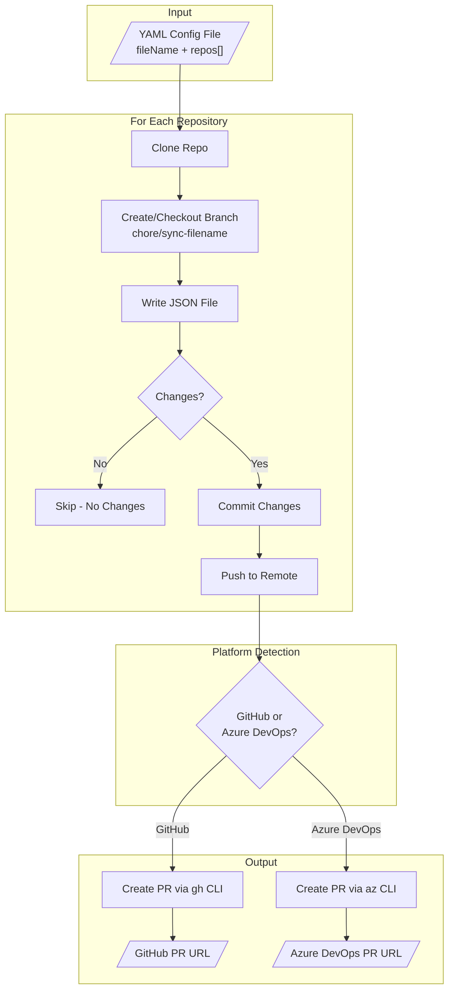

# json-config-sync

[](https://github.com/anthony-spruyt/json-config-sync/actions/workflows/ci.yml)
[](https://github.com/anthony-spruyt/json-config-sync/actions/workflows/integration.yml)
[](https://www.npmjs.com/package/@aspruyt/json-config-sync)
[](https://www.npmjs.com/package/@aspruyt/json-config-sync)

A CLI tool that syncs JSON configuration files across multiple Git repositories by creating pull requests.

## Table of Contents

- [Quick Start](#quick-start)
- [Features](#features)
- [How It Works](#how-it-works)
- [Installation](#installation)
- [Prerequisites](#prerequisites)
- [Usage](#usage)
- [Configuration Format](#configuration-format)
- [Supported Git URL Formats](#supported-git-url-formats)
- [CI/CD Integration](#cicd-integration)
- [Output Examples](#output-examples)
- [Troubleshooting](#troubleshooting)
- [Development](#development)
- [License](#license)

## Quick Start

```bash
# Install
npm install -g @aspruyt/json-config-sync

# Authenticate (GitHub)
gh auth login

# Create config.yaml
cat > config.yaml << 'EOF'
fileName: .prettierrc.json
repos:
  - git: git@github.com:your-org/frontend-app.git
    json:
      semi: false
      singleQuote: true
      tabWidth: 2
      trailingComma: es5
  - git: git@github.com:your-org/backend-api.git
    json:
      semi: false
      singleQuote: true
      tabWidth: 2
      trailingComma: es5
EOF

# Run
json-config-sync --config ./config.yaml
```

**Result:** PRs are created in both repos with `.prettierrc.json`:

```json
{
  "semi": false,
  "singleQuote": true,
  "tabWidth": 2,
  "trailingComma": "es5"
}
```

## Features

- Reads configuration from a YAML file
- Supports both GitHub and Azure DevOps repositories
- Creates PRs automatically using `gh` CLI (GitHub) or `az` CLI (Azure DevOps)
- Continues processing if individual repos fail
- Supports dry-run mode for testing
- Progress logging with summary report

## Installation

### From npm

```bash
npm install -g @aspruyt/json-config-sync
```

### From Source

```bash
git clone https://github.com/anthony-spruyt/json-config-sync.git
cd json-config-sync
npm install
npm run build
```

### Using Dev Container

Open this repository in VS Code with the Dev Containers extension. The container includes all dependencies pre-installed and the project pre-built.

## Prerequisites

### GitHub Authentication

Before using with GitHub repositories, authenticate with the GitHub CLI:

```bash
gh auth login
```

### Azure DevOps Authentication

Before using with Azure DevOps repositories, authenticate with the Azure CLI:

```bash
az login
az devops configure --defaults organization=https://dev.azure.com/YOUR_ORG project=YOUR_PROJECT
```

## Usage

```bash
# Basic usage
json-config-sync --config ./config.yaml

# Dry run (no changes made)
json-config-sync --config ./config.yaml --dry-run

# Custom work directory
json-config-sync --config ./config.yaml --work-dir ./my-temp
```

### Options

| Option       | Alias | Description                                        | Required |
| ------------ | ----- | -------------------------------------------------- | -------- |
| `--config`   | `-c`  | Path to YAML config file                           | Yes      |
| `--dry-run`  | `-d`  | Show what would be done without making changes     | No       |
| `--work-dir` | `-w`  | Temporary directory for cloning (default: `./tmp`) | No       |

## Configuration Format

Create a YAML file with the following structure:

```yaml
fileName: my.config.json
repos:
  - git: git@github.com:example-org/repo1.git
    json:
      setting1: value1
      nested:
        setting2: value2
  - git: git@ssh.dev.azure.com:v3/example-org/project/repo2
    json:
      setting1: differentValue
      setting3: value
```

### Fields

| Field          | Description                                             |
| -------------- | ------------------------------------------------------- |
| `fileName`     | The name of the JSON file to create/update in each repo |
| `repos`        | Array of repository configurations                      |
| `repos[].git`  | Git URL of the repository (SSH or HTTPS)                |
| `repos[].json` | The JSON content to write to the file                   |

## Supported Git URL Formats

### GitHub

- SSH: `git@github.com:owner/repo.git`
- HTTPS: `https://github.com/owner/repo.git`

### Azure DevOps

- SSH: `git@ssh.dev.azure.com:v3/organization/project/repo`
- HTTPS: `https://dev.azure.com/organization/project/_git/repo`

## How It Works



For each repository in the config, the tool:

1. Cleans the temporary workspace
2. Detects if repo is GitHub or Azure DevOps
3. Clones the repository
4. Creates/checks out branch `chore/sync-{sanitized-filename}`
5. Generates the JSON file from config
6. Checks for changes (skips if no changes)
7. Commits and pushes changes
8. Creates a pull request

## Example

Given this config file (`config.yaml`):

```yaml
fileName: my.config.json
repos:
  - git: git@github.com:example-org/my-service.git
    json:
      environment: production
      settings:
        feature1: true
        feature2: false
```

Running:

```bash
json-config-sync --config ./config.yaml
```

Will:

1. Clone `example-org/my-service`
2. Create branch `chore/sync-my-config`
3. Write `my.config.json` with the specified content
4. Create a PR titled "chore: sync my.config.json"

## CI/CD Integration

### GitHub Actions

```yaml
name: Sync Configs
on:
  push:
    branches: [main]
    paths: ["config.yaml"]

jobs:
  sync:
    runs-on: ubuntu-latest
    steps:
      - uses: actions/checkout@v4
      - uses: actions/setup-node@v4
        with:
          node-version: "20"
      - run: npm install -g @aspruyt/json-config-sync
      - run: json-config-sync --config ./config.yaml
        env:
          GH_TOKEN: ${{ secrets.GH_PAT }}
```

> **Note:** `GH_PAT` must be a Personal Access Token with `repo` scope to create PRs in target repositories.

### Azure Pipelines

```yaml
trigger:
  branches:
    include: [main]
  paths:
    include: ["config.yaml"]

pool:
  vmImage: "ubuntu-latest"

steps:
  - task: NodeTool@0
    inputs:
      versionSpec: "20.x"
  - script: npm install -g @aspruyt/json-config-sync
    displayName: "Install json-config-sync"
  - script: json-config-sync --config ./config.yaml
    displayName: "Sync configs"
    env:
      AZURE_DEVOPS_EXT_PAT: $(System.AccessToken)
```

> **Note:** Ensure the build service account has permission to create PRs in target repositories.

## Output Examples

### Console Output

```
[1/3] Processing example-org/repo1...
  ✓ Cloned repository
  ✓ Created branch chore/sync-my-config
  ✓ Wrote my.config.json
  ✓ Committed changes
  ✓ Pushed to remote
  ✓ Created PR: https://github.com/example-org/repo1/pull/42

[2/3] Processing example-org/repo2...
  ✓ Cloned repository
  ✓ Checked out existing branch chore/sync-my-config
  ✓ Wrote my.config.json
  ⊘ No changes detected, skipping

[3/3] Processing example-org/repo3...
  ✓ Cloned repository
  ✓ Created branch chore/sync-my-config
  ✓ Wrote my.config.json
  ✓ Committed changes
  ✓ Pushed to remote
  ✓ PR already exists: https://github.com/example-org/repo3/pull/15

Summary: 2 succeeded, 1 skipped, 0 failed
```

### Created PR

The tool creates PRs with:

- **Title:** `chore: sync {fileName}`
- **Branch:** `chore/sync-{sanitized-filename}`
- **Body:** Describes the sync action and links to documentation

## Troubleshooting

### Authentication Errors

**GitHub:**

```bash
# Check authentication status
gh auth status

# Re-authenticate if needed
gh auth login
```

**Azure DevOps:**

```bash
# Check authentication status
az account show

# Re-authenticate if needed
az login
az devops configure --defaults organization=https://dev.azure.com/YOUR_ORG
```

### Permission Denied

- Ensure your token has write access to the target repositories
- For GitHub, the token needs `repo` scope
- For Azure DevOps, ensure the user/service account has "Contribute to pull requests" permission

### Branch Already Exists

The tool automatically reuses existing branches. If you see unexpected behavior:

```bash
# Delete the remote branch to start fresh
git push origin --delete chore/sync-my-config
```

### Network/Proxy Issues

If cloning fails behind a corporate proxy:

```bash
# Configure git proxy
git config --global http.proxy http://proxy.example.com:8080
git config --global https.proxy http://proxy.example.com:8080
```

## Development

```bash
# Run in development mode
npm run dev -- --config ./fixtures/test-repos-input.yaml --dry-run

# Run tests
npm test

# Build
npm run build
```

## License

MIT
