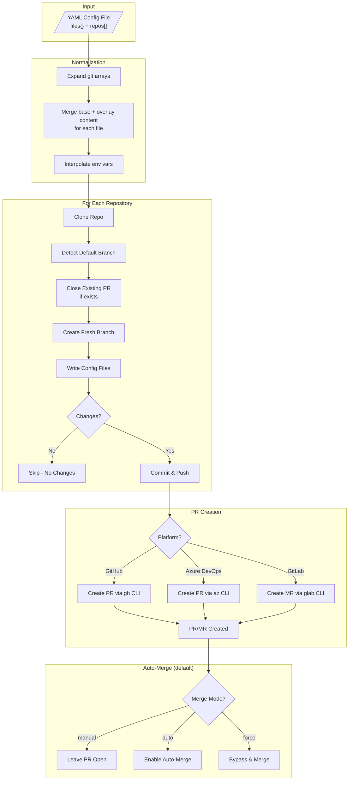

# xfg

A CLI tool that syncs JSON, JSON5, YAML, or text configuration files across multiple GitHub, Azure DevOps, and GitLab repositories by creating pull requests (or merge requests for GitLab).

Output format is automatically detected from the target filename extension:

- `.json` → JSON
- `.json5` → JSON5
- `.yaml` / `.yml` → YAML
- Other extensions → Plain text

## Quick Start

```bash
# Install
npm install -g @aspruyt/xfg

# Authenticate (GitHub)
gh auth login

# Create config.yaml
cat > config.yaml << 'EOF'
files:
  .prettierrc.json:
    content:
      semi: false
      singleQuote: true
      tabWidth: 2
      trailingComma: es5

repos:
  # Multiple repos can share the same config
  - git:
      - git@github.com:your-org/frontend-app.git
      - git@github.com:your-org/backend-api.git
      - git@github.com:your-org/shared-lib.git
EOF

# Run
xfg --config ./config.yaml
```

**Result:** PRs are created in all three repos with identical `.prettierrc.json` files.

## Features

- **Multi-File Sync** - Sync multiple config files in a single run
- **Multi-Format Output** - JSON, YAML, or plain text based on filename extension
- **Subdirectory Support** - Sync files to any path (e.g., `.github/workflows/ci.yaml`)
- **Text Files** - Sync `.gitignore`, `.markdownlintignore`, etc. with string or lines array
- **File References** - Use `@path/to/file` to load content from external template files
- **Content Inheritance** - Define base config once, override per-repo as needed
- **Multi-Repo Targeting** - Apply same config to multiple repos with array syntax
- **Environment Variables** - Use `${VAR}` syntax for dynamic values
- **Merge Strategies** - Control how arrays merge (replace, append, prepend)
- **Override Mode** - Skip merging entirely for specific repos
- **Empty Files** - Create files with no content (e.g., `.prettierignore`)
- **YAML Comments** - Add header comments and schema directives to YAML files
- **Multi-Platform** - Works with GitHub, Azure DevOps, and GitLab (including self-hosted)
- **Auto-Merge PRs** - Automatically merge PRs when checks pass, or force merge with admin privileges
- **Dry-Run Mode** - Preview changes without creating PRs
- **Error Resilience** - Continues processing if individual repos fail
- **Automatic Retries** - Retries transient network errors with exponential backoff

## How It Works



For each repository in the config, the tool:

1. Expands git URL arrays into individual entries
2. For each file, merges base content with per-repo overlay
3. Interpolates environment variables
4. Cleans the temporary workspace
5. Clones the repository
6. Detects the default branch (main/master)
7. Closes any existing PR on the branch and deletes the remote branch (fresh start)
8. Creates a fresh branch from the default branch
9. Writes all config files (JSON, JSON5, YAML, or text based on filename extension)
10. Checks for changes (skips if no changes)
11. Commits and pushes changes
12. Creates a pull request
13. Handles auto-merge based on configuration (auto by default)
